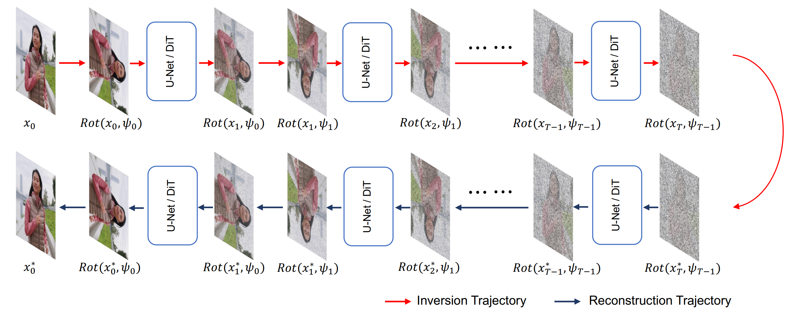

# FreeInv: Free Lunch for Improving DDIM Inversion

<font size=7><div align='center' >
[](https://github.com/yuxiangbao/FreeInv)
[](https://arxiv.org/pdf/2503.23035)
[](https://yuxiangbao.github.io/FreeInv/)
</div></font>

<div align=center>

</div>

## 🛠️ Installation
```shell
pip install -r requirements.txt
```

## 🚀 Run

### 1. DDIM Inversion

```shell
python ddim_inversion.py
```

### 2. FreeInv
```shell
python ddim_inversion.py --freeinv
```
Additional plug-and-play comparison examples, built upon the PnPInversion codebase, are available in the `FreeInv_image/` folder.

## ⭐ Cite

If you find this project useful in your research, we appreciate your star and citation of our work:

```
@article{bao2025freeinv,
  title={FreeInv: Free Lunch for Improving DDIM Inversion},
  author={Bao, Yuxiang and Liu, Huijie and Gao, Xun and Fu, Huan and Kang, Guoliang},
  journal={arXiv preprint arXiv:2503.23035},
  year={2025}
}
```

## 🎖️ Acknowledgement
This work is built upon the [plug-and-play](https://github.com/MichalGeyer/plug-and-play), [TokenFlow](https://github.com/omerbt/TokenFlow), and [PnPInversion](https://github.com/cure-lab/PnPInversion).

## 🦄 Contact
Please contact [@yuxiangbao](https://github.com/yuxiangbao) for questions, comments and reporting bugs.